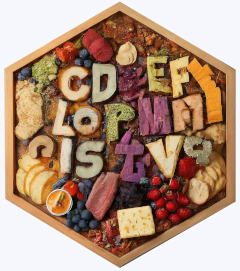

<!-- README.md is generated from README.Rmd. Please edit that file -->

```{r, include = FALSE}
knitr::opts_chunk$set(
  collapse = TRUE,
  comment = "#>",
  fig.path = "man/figures/README-",
  out.width = "100%"
)
```

# charcuterie 

<!-- badges: start -->
<!-- badges: end -->

The goal of {charcuterie} is to finally have strings as iterable character vectors.

## Installation

You can install the development version of {charcuterie} like so:

``` r
# install.packages("remotes")
remotes::install_github("jonocarroll/charcuterie")
```

## Motivation

Most programming languages seem to treat a string as an array of characters, but 
not R, where a "string" is an object of type "character" which has a length of 1. 
The number of 'characters' in a string is obtained via `nchar(x)` but otherwise, 
the individual 'characters' comprising the string are rarely exposed. 

The most common route around this limitation is to split the string into smaller 
strings, each containing a single character, i.e.

```{r}
strsplit("string", split = "")
```

which produces a list of strings, each a single character. This is cumbersome to
type out, so this package offers a cleaner approach (which does the above all
the same)

```{r}
library(charcuterie)
s <- chars("string")
s
```

This _looks like_ it did nothing, but that's the point - it still looks like a 
"string". It's actually a vector, though

```{r}
unclass(s)
```

## Example Usage

This means you can finally do vector things with it, like reverse it

```{r}
rev(s)
```

or sort it

```{r}
sort(s)
```

or index into it

```{r}
s[3]
```

{charcuterie} defines S3 methods of functions for a wide range of operations to 
be performed on a string built from a vector of characters

- index with `[`
- concatenate with `c`
- print with `format` and `print`
- slice with `head` and `tail`
- reverse with `rev`
- sort with `sort`
- set operations with `setdiff`, `union`, `intersect`, and a new `except`
- leverage existing vectorised operations like `unique`, `toupper`, and `tolower`

For more detailed usage examples, see the vignettes.
